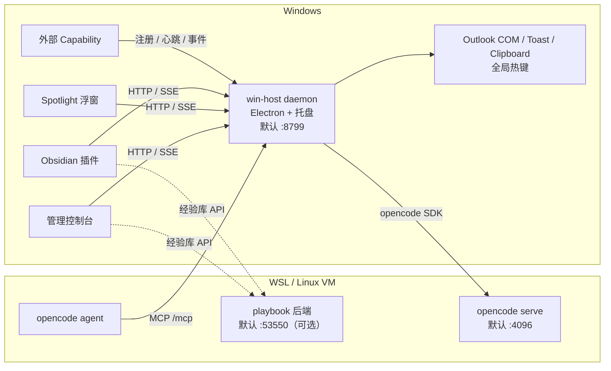

# win-console

`win-console`（应用名：**opencode Win Host**）是一个运行在 Windows 上的常驻宿主。它把 Outlook、桌面通知、剪贴板和全局热键等 Windows 原生能力，通过 HTTP、SSE 和 MCP 提供给 opencode，并提供管理控制台、快速对话浮窗和 Obsidian 插件三种入口。

项目内部包名仍为 `super-work-host`。

## 为什么需要它

当 opencode 运行在 WSL 或 Linux 虚拟机中时，它无法直接使用 Windows 上的 Outlook COM、系统通知和全局热键。win-console 在 Windows 侧常驻，将这些能力集中到一个 daemon 中：

- 原生能力不依赖 Obsidian 或控制台是否打开；
- agent 通过 MCP 自动发现 Windows 工具；
- 各个前端通过同一套 HTTP/SSE API 访问能力和实时事件；
- 新能力只需注册一次，即可按需出现在 agent、前端和管理配置中。

## 主要功能

| 功能 | 说明 |
| --- | --- |
| 快速对话 | 默认使用 `Ctrl+Space` 唤起 Spotlight 浮窗，并连接 opencode 会话 |
| 会话监控 | 在控制台查看会话进度、工具调用、待确认权限和提问，并跳转到关联任务 |
| Outlook 与邮件工作流 | 搜索、读取和保存邮件附件；按规则通知、触发会话或生成人工审核后发送的回复 |
| Taskflow | 解析 Obsidian Kanban 看板，关联任务、会话和 PHA，并通过 MCP 维护任务文档 |
| Windows 原生能力 | 提供桌面通知、剪贴板图片和经典版 Outlook COM 集成 |
| 经验库 | 前端直连独立的 playbook 后端，支持经验整理、检索和冷启动 |
| 插件平台 | 支持编译期 Capability，也支持外部进程在运行时注册能力、面板和 MCP 工具 |

## 架构



daemon 是唯一的配置源和能力注册中心。控制台与 Obsidian 中的经验库面板会从 daemon 读取后端地址，再直接访问 playbook 服务。

## 环境要求

- Windows 10/11；
- Node.js 20 或更高版本，以及 npm；
- opencode（使用对话、会话监控或邮件自动化时需要）；
- 经典版 Outlook（使用 Outlook COM 能力时需要，新版 Outlook 不支持 COM）；
- Obsidian 1.5 或更高版本（可选）；
- 独立的 playbook 后端（使用经验库时可选）。

## 快速开始

```powershell
git clone https://github.com/aleygey/win-console.git
cd win-console
npm install

# 不依赖 Electron 和 opencode 的服务端冒烟测试
npm run smoke

# 检查 host、Web 和 Obsidian 三套 TypeScript 配置
npm run typecheck

# 构建并启动托盘 daemon
npm start
```

启动后应用常驻系统托盘，不会自动显示主窗口。可以从托盘打开管理控制台，也可以在浏览器访问 `http://127.0.0.1:8799`。健康检查地址为 `http://127.0.0.1:8799/health`。

## 连接 opencode

### 1. 让 daemon 连接 opencode serve

在 WSL 或 Linux VM 中启动：

```sh
opencode serve --hostname 0.0.0.0 --port 4096
```

然后在管理控制台的全局设置中，将“opencode serve 地址”设置为 Windows 能访问的地址，例如 `http://192.168.56.101:4096`。也可以在首次启动前设置环境变量：

```powershell
$env:OPENCODE_URL = "http://192.168.56.101:4096"
npm start
```

如果 opencode 与 daemon 在同一台 Windows 主机上运行，默认的 `http://127.0.0.1:4096` 即可。

### 2. 让 agent 使用 Windows MCP 工具

将 [`opencode.example.jsonc`](opencode.example.jsonc) 中的 `mcp` 配置合并到 opencode 项目的 `opencode.jsonc`，并把地址改为 opencode 运行环境能够访问的 Windows 主机地址：

```jsonc
{
  "mcp": {
    "winhost": {
      "type": "remote",
      "url": "http://<WINDOWS_HOST_IP>:8799/mcp",
      "enabled": true
    }
  }
}
```

连接后，agent 会自动发现 `outlook_search`、`outlook_read`、`outlook_attachments`、`notify_desktop` 和 `task_*` 等工具。新增 Capability 工具时，无需再次修改 opencode 配置。

> [!IMPORTANT]
> daemon 默认监听所有网络接口，且 MCP 与业务 API 当前没有统一鉴权。请仅在可信网络或仅主机网络中使用，并通过 Windows 防火墙限制 `8799` 端口；不要将其暴露到公网。`WIN_HOST_PLUGIN_TOKEN` 只保护外部插件注册端点，不保护 `/mcp`。

## 安装 Obsidian 插件

先构建插件：

```powershell
npm run build:obsidian
```

将 `out/obsidian/` 中的以下文件复制到 vault 的 `.obsidian/plugins/winhost-console/`：

```text
main.js
manifest.json
styles.css
```

在 Obsidian 的社区插件设置中启用 **opencode Win Host**。插件默认连接 `http://127.0.0.1:8799`，可在插件设置中修改。

插件提供控制台入口、会话监控，以及启动/继续 Taskflow 任务、另开任务会话和同步 PHA 等命令。Taskflow 未手动配置扫描根时会使用当前 vault；一旦配置了扫描根，则以手动配置为准。

## 配置

常用设置可以在管理控制台中修改。以下环境变量适合首次启动、开发或故障排查：

| 环境变量 | 默认值 | 用途 |
| --- | --- | --- |
| `OPENCODE_URL` | `http://127.0.0.1:4096` | opencode serve 地址 |
| `OPENCODE_DIRECTORY` | 空 | 新会话的默认工作目录 |
| `WIN_HOST_PORT` | `8799` | daemon HTTP 端口 |
| `WIN_HOST_HOTKEY` | `Control+Space` | 全局快捷键 |
| `EXP_API` | `http://localhost:53550` | playbook 后端地址 |
| `WIN_HOST_PLUGIN_TOKEN` | 空 | 外部插件注册接口的共享 token |
| `WINHOST_GPU` | 空 | 设为 `1` 时启用 Electron 硬件加速 |
| `WINHOST_DEVTOOLS` | 空 | 设为 `1` 时自动打开 DevTools |

已保存的控制台配置优先于相应默认值。

### Taskflow 路径映射

如果任务文档位于 Windows，而 opencode 运行在 WSL、VirtualBox 或其他 Linux 环境，请在“任务看板”配置中设置路径映射，例如：

```text
C:\Users\me\Documents\Obsidian Vault=/mnt/c/Users/me/Documents/Obsidian Vault
```

多条映射使用分号分隔。Taskflow 会将映射后的路径交给 agent，并用作任务会话的工作目录。

### 经验库后端

经验库不是由 daemon 代理的内置服务。请单独启动兼容的 playbook 后端，例如：

```sh
EXP_PORT=53550 bun scripts/serve.ts
```

再在管理控制台中设置“exp · playbook 后端地址”。各前端从 daemon 读取该配置后直连后端。

## 开发命令

| 命令 | 说明 |
| --- | --- |
| `npm run smoke` | 验证 daemon 的 HTTP、SSE、MCP 和 Capability 接缝 |
| `npm run typecheck` | 检查 host、Web 和 Obsidian TypeScript 项目 |
| `npm run build:host` | 构建 daemon |
| `npm run build:renderers` | 构建控制台与 Spotlight |
| `npm run build:obsidian` | 构建 Obsidian 插件 |
| `npm run build` | 构建 daemon、控制台与 Spotlight |
| `npm run build:all` | 构建全部产物 |
| `npm run start` | 构建并启动 Electron daemon |
| `npm run dist:win` | 生成 Windows portable 与 NSIS 安装包 |

构建产物位于 `out/`，Windows 安装包位于 `dist/`。

## 项目结构

```text
src/
  contracts/        跨层类型、Capability 契约、配置与客户端接口
  host/             Electron daemon、HTTP/SSE/MCP 服务和原生能力
    capabilities/   内建能力：chat、mailflow、taskflow、notify、clipboard、exp
    native/         Outlook COM、Toast、剪贴板和图标
    shell/          托盘、全局热键和窗口管理
  panels/           控制台与 Obsidian 共用的 SolidJS 面板
  console-ui/       管理控制台
  spotlight-ui/     快速对话浮窗
  obsidian-plugin/  Obsidian 插件
docs/               外部插件平台文档
examples/           外部插件示例
scripts/            构建、验证与辅助脚本
```

## 扩展 Capability

### 内建 Capability

1. 在 `src/host/capabilities/` 中创建模块并导出 `Capability`；
2. 按需提供 `tools`、`routes`、`configSchema`、`events`、`init` 和 `dispose`；
3. 在 `src/host/capabilities/index.ts` 的 `builtinCapabilities` 中注册；
4. 如需界面，在 `src/panels/panels/<id>/` 注册 SolidJS 面板，并在对应前端入口中导入。

可以参考 `src/host/capabilities/mailflow.ts`，其中同时包含 MCP 工具、HTTP 路由、配置表单和事件。

### 外部 Capability

外部进程可以通过 `POST /capabilities/register` 在运行时注册 manifest，并通过心跳维持生命周期。注册成功后，能力可提供管理表单、iframe 面板和由 daemon 代理的 MCP 工具，无需重新编译宿主。

- [插件平台协议与安全模型](docs/plugin-platform.md)
- [串口插件示例](examples/serial-plugin/README.md)

在公司内网中运行外部插件时，建议设置 `WIN_HOST_PLUGIN_TOKEN`，并由插件通过 `x-winhost-token` 请求头携带相同 token。

## 常见问题

### 快速对话没有响应

确认 `opencode serve` 正在运行，并检查管理控制台中的服务地址。若服务位于 WSL 或 VM，还需确认 Windows 能访问该 IP 和端口。

### opencode 连接不到 `/mcp`

在 opencode 所在环境中访问 `http://<WINDOWS_HOST_IP>:8799/health`。如果失败，请检查虚拟机网络模式、Windows 防火墙和 `WIN_HOST_PORT`。

### Electron 窗口白屏

应用默认关闭硬件加速，以兼容 RDP、VDI 和受限显卡环境。如果需要启用 GPU，可设置 `WINHOST_GPU=1`。渲染日志写入 `%APPDATA%\opencode Win Host\winhost-renderer.log`，也可以设置 `WINHOST_DEVTOOLS=1` 打开开发者工具。

### Outlook 工具不可用

Outlook 能力依赖 Windows COM，只支持已配置账户的经典版桌面 Outlook。新版 Outlook、网页版 Outlook 和非 Windows 环境不受支持。
